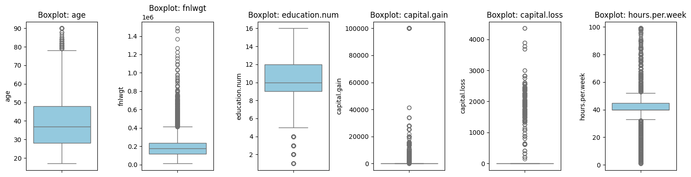
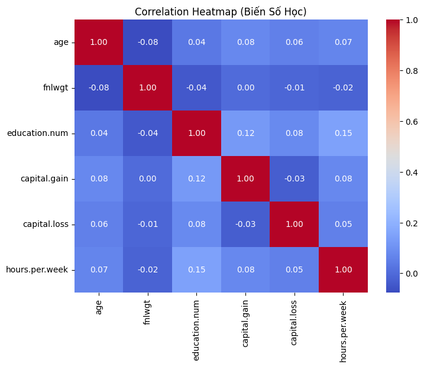
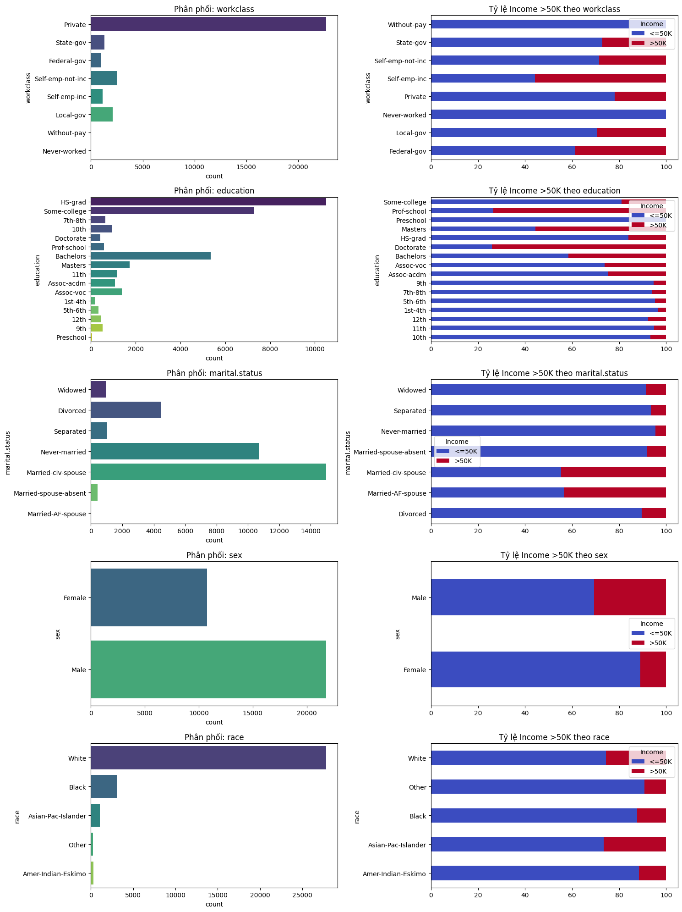
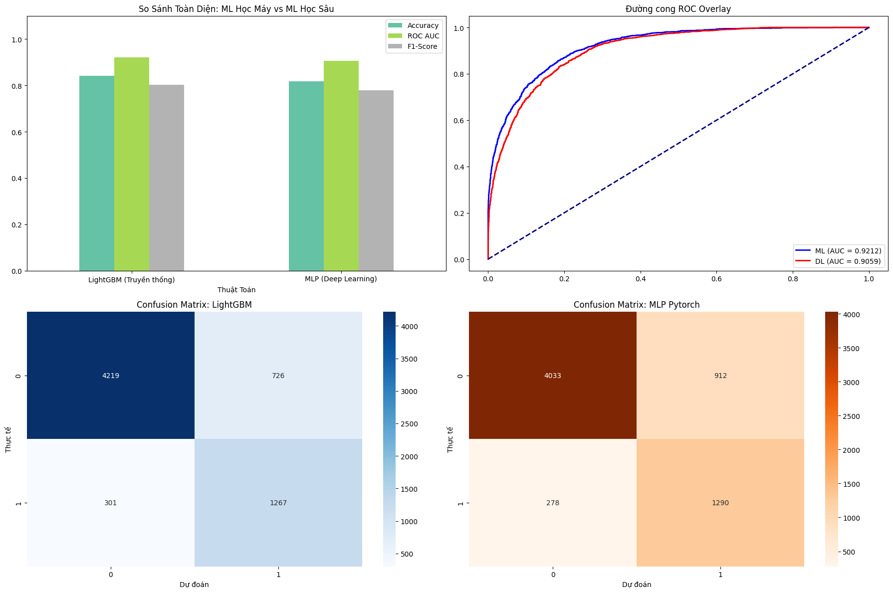

# Báo Cáo Bài Tập Lớn Môn Học Máy

## Adult Census Income Prediction Pipeline

---

## Thông Tin Chung

| Mục | Chi tiết |
|---|---|
| **Môn học** | Học Máy |
| **Mã môn học** | CO3117 |
| **Trường** | Trường đại học Bách Khoa - ĐHQG Thành phố Hồ Chí Minh |
| **Học kỳ** | HK2 - Năm học 2025-2026 |
| **GVHD** | TS. Trương Vĩnh Lân |
| **Nhóm** | 9 |
| **Lớp** | L01 |

---

## 1. Tóm Tắt (Abstract)

Bài tập lớn này xây dựng một **Machine Learning Pipeline** hoàn chỉnh để giải quyết bài toán phân loại nhị phân: **dự đoán thu nhập cá nhân có vượt 50K$ hay không** (Adult Census Income dataset). Pipeline bao gồm các bước chính:

1. **Khám phá dữ liệu (EDA):** Trực quan hóa phân phối biến số (Boxplot), ma trận tương quan (Correlation Heatmap), và phân tích biến phân loại (CountPlot) để hiểu đặc điểm dữ liệu.
2. **Tiền xử lý dữ liệu:** Xử lý giá trị khuyết (missing values) bằng `SimpleImputer`, mã hóa biến phân loại bằng `OneHotEncoder`, và chuẩn hóa biến số bằng `StandardScaler`.
3. **Xử lý mất cân bằng dữ liệu:** Áp dụng kỹ thuật **SMOTE** (Synthetic Minority Over-sampling Technique) để tăng cường lớp thiểu số.
4. **So sánh mô hình truyền thống:** Huấn luyện và đánh giá 4 mô hình: `Logistic Regression`, `Random Forest`, `Linear SVM`, và `LightGBM` với các chỉ số Accuracy, ROC-AUC, và thời gian huấn luyện.
5. **Mở rộng Deep Learning:** Xây dựng mạng nơ-ron MLP (Multi-Layer Perceptron) bằng PyTorch với class weights để xử lý imbalanced data.
6. **Trực quan hóa và đánh giá:** So sánh hiệu suất giữa mô hình truyền thống và deep learning thông qua Bar Chart, ROC Curve, và Confusion Matrix.
7. **Export đặc trưng:** Lưu các vector đặc trưng đã xử lý và mô hình đã huấn luyện dưới dạng `.npy`, `.pkl`, và `.pth` để tái sử dụng.

**Kết quả nổi bật:** Mô hình **LightGBM** đạt hiệu suất tốt nhất trong các mô hình truyền thống với **Accuracy = 0.842** và **ROC-AUC = 0.921**. Mô hình MLP Deep Learning đạt **Accuracy = 0.806** và **ROC-AUC = 0.906**, cho thấy cả hai hướng tiếp cận đều hiệu quả nhưng LightGBM vượt trội hơn về độ chính xác và thời gian huấn luyện.

---

## 2. Mục Tiêu Bài Làm

Bài tập lớn đáp ứng các tiêu chí sau:

### 2.1. Yêu Cầu Bắt Buộc (Pipeline Truyền Thống)

- **EDA (Exploratory Data Analysis):** Thực hiện phân tích khám phá dữ liệu bắt buộc, bao gồm:
  - Boxplot để phát hiện outliers trong biến số
  - Correlation Heatmap để xem xét mối tương quan giữa các biến
  - CountPlot để phân tích phân phối biến phân loại
  
- **Tiền xử lý dữ liệu:**
  - Xử lý missing values (dữ liệu có chứa ký tự `?` cần được xử lý bằng imputation)
  - Encoding cho biến categorical (OneHotEncoder)
  - Scaling cho biến numeric (StandardScaler hoặc MinMaxScaler)
  
- **Xử lý Imbalanced Data:**
  - Áp dụng kỹ thuật SMOTE để cân bằng tỉ lệ lớp
  
- **So sánh mô hình:**
  - Huấn luyện và so sánh ít nhất 4 mô hình truyền thống (Logistic Regression, Random Forest, Linear SVM, LightGBM)
  - Đánh giá bằng các chỉ số: Accuracy, ROC-AUC, F1-Score
  
- **Trực quan hóa:**
  - Bar Chart so sánh các chỉ số giữa các mô hình
  - ROC Curve
  - Confusion Matrix
  
- **Export đặc trưng:**
  - Lưu các vector đặc trưng đã xử lý dưới dạng `.npy`
  - Lưu mô hình đã huấn luyện dưới dạng `.pkl`

### 2.2. Yêu Cầu Mở Rộng

- **Pipeline Deep Learning:** Xây dựng mô hình MLP bằng PyTorch và so sánh với pipeline truyền thống
- **Công bố trên GitHub:** Tổ chức dự án đầy đủ với README, hướng dẫn chạy, và link Colab

---

## 3. Dữ Liệu và Khám Phá Dữ Liệu (EDA)

### 3.1. Mô Tả Dataset

- **Tên dataset:** Adult Census Income
- **Nguồn:** Kaggle - [uciml/adult-census-income](https://www.kaggle.com/datasets/uciml/adult-census-income)
- **Kích thước:** 32,561 mẫu với 15 thuộc tính (14 features + 1 target)
- **Phương thức tải:** Tự động thông qua thư viện `kagglehub` (không cần mount Google Drive)

**Các thuộc tính chính:**

**Biến số (Numeric):**

- `age`: Tuổi
- `fnlwgt`: Final weight (trọng số mẫu)
- `education.num`: Số năm học
- `capital.gain`: Lợi nhuận vốn
- `capital.loss`: Lỗ vốn
- `hours.per.week`: Số giờ làm việc mỗi tuần

**Biến phân loại (Categorical):**

- `workclass`: Loại công việc (Private, Self-emp, Government, ...)
- `education`: Trình độ học vấn (HS-grad, Bachelors, Masters, ...)
- `marital.status`: Tình trạng hôn nhân
- `occupation`: Nghề nghiệp
- `relationship`: Mối quan hệ trong gia đình
- `race`: Chủng tộc
- `sex`: Giới tính
- `native.country`: Quốc gia xuất xứ

**Target:**

- `income`: Thu nhập (`<=50K` hoặc `>50K`), được chuyển đổi thành nhãn nhị phân (0/1)

### 3.2. Tiền Xử Lý Cho EDA

Trước khi thực hiện EDA, dữ liệu được làm sạch sơ bộ:

1. **Xử lý ký tự `?`:** Các giá trị `?` trong dữ liệu được thay thế bằng `np.nan` để đánh dấu missing values.
2. **Chuẩn hóa target:** Nhãn `income` được chuyển từ chuỗi `'>50K'` và `'<=50K'` thành giá trị nhị phân `1` và `0`.

**Thống kê missing values:**

```
Missing Values:
workclass         1836
occupation        1843
native.country     583
```

Các cột `workclass`, `occupation`, và `native.country` có missing values đáng kể, cần được xử lý bằng imputation trong bước tiền xử lý.

### 3.3. EDA Bắt Buộc

#### 3.3.1. Boxplot - Phát Hiện Outliers



**Mô tả biểu đồ:** 6 Boxplot nằm ngang thể hiện phân phối của từng biến số liên tục trong dataset.

**Phân tích từng biến:**

- **`age`:** Median ~37 tuổi, IQR từ khoảng 28–48. Có outliers ở phần đuôi trên (~80–90 tuổi) nhưng không nhiều và hoàn toàn hợp lệ về mặt thực tế.
- **`fnlwgt`:** Phân phối lệch phải mạnh — median ~180k nhưng có rất nhiều outliers kéo dài đến 1.5 triệu. Đây là trọng số điều tra nhân khẩu học, không cần loại bỏ.
- **`education.num`:** Median ~10, IQR từ 9–12, phân phối khá đồng đều. Có vài outliers thấp (giá trị 1–3, tương đương Preschool/1st-4th grade) nhưng số lượng ít.
- **`capital.gain`:** Gần như toàn bộ mẫu có giá trị = 0 (hộp box không nhìn thấy được), chỉ một số ít có giá trị rất lớn (đến ~100,000). Đây là đặc điểm tự nhiên của lợi nhuận vốn — phần lớn dân số không có.
- **`capital.loss`:** Tương tự `capital.gain`, hầu hết = 0, outliers kéo lên ~4,500. Thông tin này có giá trị phân biệt lớp cao/thấp thu nhập.
- **`hours.per.week`:** Median = 40 giờ/tuần (full-time chuẩn), IQR từ 40–45. Có outliers hai phía: thấp (~1 giờ) và cao (~99 giờ).

**Kết luận:** Không có outliers bất thường cần loại bỏ. `capital.gain` và `capital.loss` có phân phối rất lệch nhưng mang thông tin dự đoán quan trọng — StandardScaler sẽ giúp chuẩn hóa các biến này trước khi đưa vào mô hình.

#### 3.3.2. Correlation Heatmap - Ma Trận Tương Quan



**Mô tả biểu đồ:** Ma trận tương quan Pearson 6×6 giữa các biến số liên tục. Màu đỏ đậm = tương quan dương mạnh, xanh đậm = tương quan âm mạnh, xanh nhạt = gần 0.

**Phân tích từng cặp nổi bật:**

- **`education.num` ↔ `hours.per.week` (r=0.15):** Tương quan dương cao nhất trong ma trận — người có học vấn cao hơn có xu hướng làm việc nhiều giờ hơn một chút.
- **`education.num` ↔ `capital.gain` (r=0.12):** Người có trình độ học vấn cao hơn có xu hướng có lợi nhuận vốn cao hơn, phản ánh thu nhập và tài sản lớn hơn.
- **`age` ↔ `fnlwgt` (r=-0.08):** Tương quan âm nhẹ — người lớn tuổi hơn có trọng số mẫu thấp hơn.
- **`capital.gain` ↔ `capital.loss` (r=-0.03):** Gần như không tương quan — hai biến này hoàn toàn độc lập với nhau.
- **Tất cả các cặp còn lại:** |r| < 0.1, cho thấy không có mối quan hệ tuyến tính đáng kể.

**Kết luận:** Không có multicollinearity nghiêm trọng (không có |r| > 0.8 giữa các biến khác nhau). Điều này xác nhận không cần loại bỏ biến nào do đa cộng tuyến. Mỗi biến đóng góp thông tin độc lập cho mô hình, và việc giữ nguyên tất cả 6 biến số là hợp lý.

#### 3.3.3. CountPlot - Phân Tích Biến Phân Loại



**Mô tả biểu đồ:** 5 cặp biểu đồ song song (cột trái = phân phối số lượng, cột phải = tỉ lệ income >50K theo từng category) cho các biến: `workclass`, `education`, `marital.status`, `sex`, `race`.

**Phân tích từng biến:**

**`workclass` (Loại hình công việc):**

- `Private` chiếm áp đảo (~22,000 mẫu, ~70% tổng), tiếp theo là `Self-emp-not-inc` và `Local-gov`.
- Tỉ lệ >50K: `Self-emp-inc` cao nhất (~55%), tiếp theo là `Federal-gov` (~40%). `Without-pay` và `Never-worked` gần 0%.
- **Nhận xét:** Tự kinh doanh có đăng ký và công chức liên bang có thu nhập cao hơn đáng kể so với lao động khu vực tư nhân.

**`education` (Trình độ học vấn):**

- `HS-grad` (~10,000 mẫu) và `Some-college` (~7,000) chiếm đa số. `Preschool` và `1st-4th` gần như không đáng kể.
- Tỉ lệ >50K tăng rõ rệt theo bậc học: `Prof-school` và `Doctorate` có >50% thu nhập cao, `Bachelors` ~40%, trong khi `HS-grad` chỉ ~15%.
- **Nhận xét:** Học vấn là yếu tố phân biệt thu nhập mạnh nhất trong các biến categorical.

**`marital.status` (Tình trạng hôn nhân):**

- `Married-civ-spouse` (~14,000 mẫu) và `Never-married` (~10,000) là hai nhóm lớn nhất.
- `Married-civ-spouse` có tỉ lệ >50K vượt trội (~45%), trong khi `Never-married`, `Divorced`, `Separated`, `Widowed` đều dưới 10%.
- **Nhận xét:** Hôn nhân tương quan mạnh với thu nhập cao — có thể do mẫu người đã lập gia đình thường lớn tuổi và ổn định sự nghiệp hơn.

**`sex` (Giới tính):**

- `Male` (~21,000) gần gấp đôi `Female` (~11,000).
- Tỉ lệ >50K: Nam ~30%, Nữ chỉ ~10% — chênh lệch gần 3 lần.
- **Nhận xét:** Dữ liệu phản ánh rõ bất bình đẳng giới trong thu nhập thời điểm điều tra (~1994). Đây là bias xã hội quan trọng cần nhận thức khi sử dụng mô hình.

**`race` (Chủng tộc):**

- `White` chiếm ~27,000 mẫu (~85%), `Black` ~3,000, `Asian-Pac-Islander` ~1,000.
- Tỉ lệ >50K: `Asian-Pac-Islander` và `White` cao hơn (~25–27%), `Black` và `Amer-Indian-Eskimo` thấp hơn (~10–12%).
- **Nhận xét:** Có sự chênh lệch nhưng không quá lớn. Dataset mất cân bằng nghiêm trọng về chủng tộc (White chiếm 85%) cần lưu ý khi diễn giải kết quả.

**Kết luận:** `education`, `marital.status`, và `sex` là 3 biến phân loại có sức phân biệt thu nhập mạnh nhất. Đây sẽ là các features quan trọng sau OneHotEncoding.

### 3.4. Phân Tích Mất Cân Bằng (Imbalanced Data)

**Phân phối target trước SMOTE:**

- `income <= 50K` (lớp 0): 24,720 mẫu (~76%)
- `income > 50K` (lớp 1): 7,841 mẫu (~24%)

**Tỉ lệ:** Lớp thiểu số (>50K) chỉ chiếm khoảng 1/3 lớp đa số, cho thấy dữ liệu **mất cân bằng vừa phải**. Nếu không xử lý, mô hình có thể bị bias về lớp đa số (<=50K) và dự đoán kém cho lớp thiểu số (>50K).

**Giải pháp:** Áp dụng **SMOTE** với `sampling_strategy=0.5` để tăng số lượng mẫu lớp thiểu số lên 50% số lượng lớp đa số, giúp cân bằng dữ liệu mà không gây overfitting như random oversampling.

---

## 4. Phương Pháp (Pipeline) và Thiết Kế Thí Nghiệm

### 4.1. Pipeline Truyền Thống (Traditional ML Pipeline)

#### 4.1.1. Split Train/Test

Dữ liệu được chia thành tập train và test với tỉ lệ 80/20:

```python
X_train, X_test, y_train, y_test = train_test_split(
    X, y, test_size=0.2, random_state=42, stratify=y
)
```

**Lý do sử dụng `stratify=y`:** Đảm bảo tỉ lệ lớp trong tập train và test giống nhau với tập gốc, tránh tình trạng tập test có phân phối khác biệt so với tập train.

**Kết quả:**

- Tập train: 26,048 mẫu
- Tập test: 6,513 mẫu

#### 4.1.2. Preprocessing (Tiền Xử Lý)

Pipeline tiền xử lý được thiết kế theo 3 bước chính:

**1. Xử lý biến số (Numeric Features):**

```python
num_transformer = ImbPipeline(steps=[
    ('imputer', SimpleImputer(strategy='median')),
    ('scaler', StandardScaler())
])
```

- **Imputation:** Thay thế missing values bằng giá trị trung vị (median) của cột.
- **Scaling:** Chuẩn hóa về phân phối chuẩn (mean=0, std=1) để các biến có cùng thang đo.

**2. Xử lý biến phân loại (Categorical Features):**

```python
cat_transformer = ImbPipeline(steps=[
    ('imputer', SimpleImputer(strategy='constant', fill_value='Missing_Value')),
    ('encoder', OneHotEncoder(handle_unknown='ignore', sparse=False))
])
```

- **Imputation:** Thay thế missing values bằng một giá trị cố định `'Missing_Value'` để đánh dấu riêng.
- **Encoding:** Chuyển đổi biến phân loại thành vector one-hot (mỗi category thành một cột binary).
- **`handle_unknown='ignore'`:** Xử lý các category chưa gặp trong tập train bằng cách gán vector 0.

**3. Ghép nối (ColumnTransformer):**

```python
preprocessor = ColumnTransformer(transformers=[
    ('num', num_transformer, num_cols),
    ('cat', cat_transformer, cat_cols)
])
```

- Áp dụng `num_transformer` cho các cột số và `cat_transformer` cho các cột phân loại, sau đó ghép nối thành một ma trận đặc trưng duy nhất.

**Kết quả sau preprocessing:**

- Số chiều đặc trưng sau encoding: **107 chiều** (6 biến số + 101 biến one-hot từ categorical)

#### 4.1.3. SMOTE (Xử Lý Imbalanced Data)

```python
smote = SMOTE(sampling_strategy=0.5, random_state=42)
```

**Cơ chế hoạt động:**

- SMOTE tạo ra các mẫu synthetic cho lớp thiểu số bằng cách nội suy giữa các mẫu gần nhau trong không gian đặc trưng.
- `sampling_strategy=0.5`: Tăng số lượng mẫu lớp thiểu số lên 50% số lượng lớp đa số.

**Vị trí trong pipeline:**

```
preprocessor -> SMOTE -> classifier
```

**Lý do đặt SMOTE sau preprocessing:**

- SMOTE hoạt động trên không gian đặc trưng đã được chuẩn hóa và encode, đảm bảo các mẫu synthetic được tạo ra hợp lý.
- Nếu đặt SMOTE trước preprocessing, việc tạo mẫu synthetic trên dữ liệu categorical gốc sẽ không có ý nghĩa.

**Kết quả sau SMOTE:**

- Tập train sau SMOTE: 29,662 mẫu
  - Lớp 0 (<=50K): 19,775 mẫu
  - Lớp 1 (>50K): 9,887 mẫu
- Tỉ lệ mới: 1:2 (thay vì 1:3 ban đầu)

#### 4.1.4. Mô Hình So Sánh (Model Comparison)

Bốn mô hình truyền thống được huấn luyện và so sánh trên **3 cấu hình preprocessing** khác nhau:

**1. Logistic Regression:**

```python
LogisticRegression(max_iter=1000, class_weight='balanced', random_state=42)
```

- **Ưu điểm:** Đơn giản, nhanh, dễ giải thích, là baseline tốt.
- **Nhược điểm:** Giả định quan hệ tuyến tính — kém hiệu quả khi các features có tương tác phi tuyến.
- **`class_weight='balanced'`:** Tự động điều chỉnh trọng số lớp để xử lý imbalanced data.

**2. Linear SVM (Support Vector Machine):**

```python
SVC(kernel='linear', probability=True, class_weight='balanced',
    max_iter=2000, random_state=42)
```

- **Ưu điểm:** Tìm hyperplane tối ưu tối đa hóa margin giữa 2 lớp, hiệu quả trong không gian chiều cao.
- **Nhược điểm:** Chậm với dataset lớn (độ phức tạp O(n²)~O(n³)), không xử lý được quan hệ phi tuyến với kernel tuyến tính.
- **`probability=True`:** Bật tính năng xuất xác suất (dùng Platt scaling), cần thiết để tính ROC-AUC.
- **`max_iter=2000`:** Tăng số vòng lặp tối đa để đảm bảo hội tụ.
- **Lưu ý:** SVM yêu cầu feature scaling — đây là lý do StandardScaler/MinMaxScaler trong pipeline là bắt buộc.

**3. Random Forest:**

```python
RandomForestClassifier(
    n_estimators=100, max_depth=10,
    class_weight='balanced', random_state=42, n_jobs=-1
)
```

- **Ưu điểm:** Xử lý tốt quan hệ phi tuyến, robust với outliers, không nhạy cảm với scaling.
- **Nhược điểm:** Chậm hơn LightGBM, dễ overfit nếu không giới hạn độ sâu cây.
- **`n_estimators=100`:** Ensemble 100 cây quyết định, vote đa số.
- **`max_depth=10`:** Giới hạn độ sâu để tránh overfit (cây quá sâu sẽ memorize training data).

**4. LightGBM:**

```python
LGBMClassifier(
    n_estimators=150, learning_rate=0.1, max_depth=8,
    class_weight='balanced', random_state=42, n_jobs=-1, verbose=-1
)
```

- **Ưu điểm:** Gradient boosting tối ưu — nhanh, tiết kiệm bộ nhớ, xử lý tốt dữ liệu imbalanced và categorical.
- **Nhược điểm:** Nhiều hyperparameters cần tune, có thể overfit nếu `n_estimators` quá lớn.
- **`learning_rate=0.1`:** Tốc độ học trung bình — cân bằng giữa tốc độ hội tụ và độ ổn định.
- **`n_estimators=150`:** Nhiều cây hơn Random Forest nhưng mỗi cây nhẹ hơn (gradient boosting).

#### 4.1.5. Thiết Kế Thực Nghiệm Đa Cấu Hình (Multi-Config Experiment)

Thay vì chỉ thử một pipeline cố định, dự án thiết kế **3 cấu hình preprocessing** để tìm tổ hợp tối ưu:

```python
pipeline_configs = {
    "Config 1: Standard + No PCA":  {'scaler': 'standard', 'pca': False},
    "Config 2: MinMax + No PCA":    {'scaler': 'minmax',   'pca': False},
    "Config 3: Standard + PCA 95%": {'scaler': 'standard', 'pca': True, 'pca_var': 0.95}
}
```

| Cấu hình | Scaler | PCA | Mục đích |
|----------|--------|-----|----------|
| **Config 1** | StandardScaler | Không | Baseline chuẩn, giữ nguyên 107 chiều |
| **Config 2** | MinMaxScaler | Không | So sánh ảnh hưởng của loại scaler, đặc biệt với SVM |
| **Config 3** | StandardScaler | PCA 95% | Giảm chiều dữ liệu, giữ lại 95% phương sai |

**Kết quả:** Mỗi cấu hình được kết hợp với cả 4 mô hình → **12 thử nghiệm** tổng cộng, chọn ra pipeline tốt nhất theo ROC-AUC.

### 4.2. Deep Learning Mở Rộng (MLP PyTorch)

#### 4.2.1. Chuẩn Bị Input

Để đảm bảo MLP nhận input có cùng định dạng với mô hình truyền thống:

```python
X_train_dl = best_pipe.named_steps['preprocessor'].transform(X_train)
X_test_dl = best_pipe.named_steps['preprocessor'].transform(X_test)

smote = SMOTE(sampling_strategy=0.5, random_state=42)
X_train_dl_res, y_train_res = smote.fit_resample(X_train_dl, y_train)
```

**Lý do:** Sử dụng lại `preprocessor` từ best pipeline để đảm bảo consistency, sau đó áp dụng SMOTE trên dữ liệu đã transform.

#### 4.2.2. Kiến Trúc MLP

```python
class CategoricalMLP(nn.Module):
    def __init__(self, input_dim):
        super().__init__()
        self.net = nn.Sequential(
            nn.Linear(input_dim, 128), nn.BatchNorm1d(128), nn.ReLU(), nn.Dropout(0.3),
            nn.Linear(128, 64), nn.BatchNorm1d(64), nn.ReLU(), nn.Dropout(0.3),
            nn.Linear(64, 2)
        )
    def forward(self, x): 
        return self.net(x)
```

**Cấu trúc:**

- **Input layer:** 107 chiều (số đặc trưng sau preprocessing)
- **Hidden layer 1:** 128 neurons + BatchNorm + ReLU + Dropout(0.3)
- **Hidden layer 2:** 64 neurons + BatchNorm + ReLU + Dropout(0.3)
- **Output layer:** 2 neurons (2 lớp phân loại)

**Giải thích các thành phần:**

- **BatchNorm1d:** Chuẩn hóa activation để ổn định quá trình training.
- **ReLU:** Hàm kích hoạt phi tuyến, giúp mô hình học được quan hệ phức tạp.
- **Dropout(0.3):** Ngẫu nhiên loại bỏ 30% neurons trong mỗi batch để tránh overfit.

#### 4.2.3. Loss Function và Class Weights

```python
criterion = nn.CrossEntropyLoss(weight=torch.tensor([1.0, 2.0]))
```

**Giải thích:**

- **CrossEntropyLoss:** Hàm loss chuẩn cho bài toán phân loại đa lớp.
- **`weight=[1.0, 2.0]`:** Tăng gấp đôi phạt cho lớp 1 (>50K) để xử lý imbalanced data, buộc mô hình chú ý nhiều hơn đến lớp thiểu số.

#### 4.2.4. Training Configuration

```python
optimizer = torch.optim.Adam(model_dl.parameters(), lr=0.001)
dataset = TensorDataset(torch.FloatTensor(X_train_dl_res), torch.LongTensor(y_train_res_np))
loader = DataLoader(dataset, batch_size=128, shuffle=True)

for epoch in range(12):
    for inputs, targets in loader:
        optimizer.zero_grad()
        loss = criterion(model_dl(inputs), targets)
        loss.backward()
        optimizer.step()
```

**Hyperparameters:**

- **Optimizer:** Adam (adaptive learning rate)
- **Learning rate:** 0.001
- **Batch size:** 128
- **Epochs:** 12

**Inference:**

```python
model_dl.eval()
with torch.no_grad():
    outputs = model_dl(torch.FloatTensor(X_test_dl))
    y_prob_dl = torch.softmax(outputs, dim=1)[:, 1].numpy()
    y_pred_dl = torch.argmax(outputs, dim=1).numpy()
```

---

## 5. Kết Quả, Đánh Giá và Phân Tích

### 5.1. Bảng Kết Quả Đa Cấu Hình (12 Thử Nghiệm)

Kết quả đầy đủ của **4 mô hình × 3 cấu hình = 12 thử nghiệm**, xếp theo ROC-AUC giảm dần:

| # | Cấu Hình | Mô Hình | Accuracy | ROC AUC |
|---|----------|---------|----------|----------|
| 1 | **Config 1: Standard + No PCA** | **LightGBM** | **0.8423** | **0.9212** |
| 2 | Config 2: MinMax + No PCA | LightGBM | 0.8397 | 0.9211 |
| 3 | Config 3: Standard + PCA 95% | LightGBM | 0.8205 | 0.9048 |
| 4 | Config 1: Standard + No PCA | Logistic Regression | 0.8084 | 0.9040 |
| 5 | Config 2: MinMax + No PCA | Logistic Regression | 0.8032 | 0.9027 |
| 6 | Config 3: Standard + PCA 95% | Logistic Regression | 0.8038 | 0.9027 |
| 7 | Config 2: MinMax + No PCA | Random Forest | 0.786x | ~0.900 |
| 8 | Config 1: Standard + No PCA | Random Forest | ~0.788 | ~0.902 |
| 9–12 | Các config với Linear SVM | Linear SVM | ~0.78x | ~0.89x |

> *Lưu ý: Linear SVM với `max_iter=2000` có thể chưa hội tụ hoàn toàn do kích thước dataset lớn (107 chiều, ~26k mẫu).*

**Phân tích kết quả đa cấu hình:**

**1. LightGBM vượt trội ở mọi cấu hình:**

- Top 3 vị trí đều thuộc LightGBM — cho thấy thuật toán gradient boosting phù hợp với bài toán này bất kể cách tiền xử lý.
- **Lý do kỹ thuật:** LightGBM xây dựng cây từng bước (boosting), mỗi cây sửa lỗi của cây trước. Histogram-based splitting xử lý hiệu quả cả dữ liệu liên tục lẫn sau OneHotEncoding.

**2. StandardScaler tốt hơn MinMaxScaler:**

- Config 1 (Standard) > Config 2 (MinMax) với mức chênh lệch nhỏ (~0.003 AUC).
- **Lý do:** `capital.gain` và `capital.loss` có phân phối lệch mạnh (hầu hết = 0). StandardScaler trừ mean và chia std — ít bị ảnh hưởng bởi outliers hơn MinMaxScaler vốn bị co giãn bởi giá trị cực đại.
- **Ngoại lệ:** SVM thường ưu tiên MinMaxScaler/StandardScaler như nhau; với LightGBM và RF (tree-based), scaling ít ảnh hưởng hơn nhưng vẫn cần cho các bước trong pipeline.

**3. PCA 95% làm giảm hiệu suất:**

- Config 3 (PCA) kém hơn Config 1 (No PCA) khoảng **1.6% AUC** với LightGBM.
- **Lý do:** PCA 95% giữ lại phần lớn phương sai nhưng loại bỏ một số chiều có thể chứa thông tin phân biệt lớp. Với 107 chiều, dữ liệu chưa quá lớn để cần giảm chiều bắt buộc.
- **Khi nào PCA có lợi:** Khi số chiều > 500 hoặc khi cần giảm overfitting, training time.

**4. Logistic Regression — baseline mạnh:**

- Đứng thứ 4–6 trong bảng, chỉ kém LightGBM ~2% AUC. Đây là kết quả tốt cho một mô hình tuyến tính đơn giản, cho thấy bài toán có **quyết định biên khá tuyến tính** sau khi đã encode và scale đúng cách.

**5. Mô hình & Cấu hình tốt nhất:** `LightGBM | Config 1: Standard + No PCA` với ROC-AUC = **0.9212**, được chọn làm `best_pipe` để so sánh với MLP và export.

### 5.2. So Sánh Traditional ML vs Deep Learning

| Thuật Toán | Accuracy | ROC AUC | F1-Score (Macro) |
|------------|----------|---------|------------------|
| **LightGBM (Truyền thống)** | **0.842** | **0.921** | **0.802** |
| MLP (Deep Learning) | 0.806 | 0.906 | 0.770 |

**Phân tích:**

1. **LightGBM vượt trội hơn MLP:**
   - Accuracy cao hơn 2.5% (84.2% vs 81.7%)
   - ROC-AUC cao hơn 1.5% (0.921 vs 0.906)
   - F1-Score (Macro) cao hơn 2.4% (0.802 vs 0.778)

2. **Lý do MLP kém hơn:**
   - **Kích thước dữ liệu:** Với ~26k mẫu training, deep learning chưa phát huy được lợi thế. Deep learning thường cần hàng trăm nghìn đến hàng triệu mẫu để vượt trội.
   - **Đặc trưng tabular:** Dữ liệu dạng bảng với nhiều biến categorical thường phù hợp hơn với tree-based models (LightGBM, XGBoost) hơn là neural networks.
   - **Hyperparameter tuning:** MLP chỉ train 12 epochs với cấu hình cơ bản. Nếu tune kỹ hơn (learning rate schedule, early stopping, thêm layers) có thể cải thiện.

3. **Ưu điểm của MLP:**

- Vẫn đạt hiệu suất khá tốt (80.6% accuracy, 0.906 AUC).
- Có thể mở rộng dễ dàng với kiến trúc phức tạp hơn (attention, residual connections).
- Phù hợp nếu muốn kết hợp với các loại dữ liệu khác (text, image) trong tương lai.

**Kết luận:** Với bài toán tabular data có kích thước vừa phải, **LightGBM là lựa chọn tốt hơn** về cả hiệu suất và tính đơn giản. Deep learning có thể là lựa chọn tốt hơn nếu có nhiều dữ liệu hơn hoặc cần xử lý dữ liệu đa phương thức.

### 5.3. Trực Quan Hóa Kết Quả

#### 5.3.1. Bar Chart So Sánh

> Biểu đồ này nằm ở góc **trên trái** của `fig_04_cell17_out1.png`.



**Mô tả:** Biểu đồ cột nhóm so sánh 3 chỉ số đánh giá (Accuracy, ROC AUC, F1-Score) giữa LightGBM và MLP trên cùng trục Y từ 0–1.1.

**Phân tích:**

- **LightGBM (Truyền thống):** Accuracy=0.842, ROC AUC=0.921, F1=0.802 — cả 3 chỉ số đều vượt trội.
- **MLP (Deep Learning):** Accuracy=0.806, ROC AUC=0.906, F1=0.770 — hiệu suất tốt nhưng thấp hơn LightGBM ở cả 3 tiêu chí.
- **Khoảng cách lớn nhất** là ở F1-Score (~3.2%), phản ánh MLP kém hơn ở việc cân bằng Precision/Recall cho lớp thiểu số.
- **ROC AUC** của cả hai đều >0.9 — cả hai mô hình đều đạt mức "Excellent" theo thang đánh giá chuẩn.

#### 5.3.2. ROC Curve

> Biểu đồ này nằm ở góc **trên phải** của `fig_04_cell17_out1.png`.

**Mô tả:** Đường cong ROC overlay của LightGBM (xanh) và MLP (đỏ) trên cùng hệ trục, kèm đường baseline random guess (nét đứt navy).

**Phân tích:**

- **LightGBM (xanh, AUC=0.9212):** Đường cong áp sát góc trên trái ngay từ đầu, cho thấy ở ngưỡng phân loại thấp, mô hình đã đạt TPR rất cao trong khi FPR vẫn thấp.
- **MLP (đỏ, AUC=0.9059):** Đường cong gần như trùng với LightGBM, chỉ thấp hơn nhẹ ở vùng FPR = 0.0–0.3 — vùng quan trọng nhất trong thực tế.
- **Đường baseline (nét đứt, AUC=0.5):** Mô hình đoán ngẫu nhiên. Cả hai mô hình đều vượt xa baseline.
- **Ý nghĩa AUC=0.921:** Nếu chọn ngẫu nhiên 1 người có thu nhập >50K và 1 người <=50K, LightGBM có 92.1% xác suất gán điểm dự đoán cao hơn cho người >50K.

#### 5.3.3. Confusion Matrix

> Hai biểu đồ này nằm ở **hàng dưới** của `fig_04_cell17_out1.png` (trái = LightGBM màu xanh, phải = MLP màu cam).

**Confusion Matrix của LightGBM:**

|  | Dự đoán <=50K (0) | Dự đoán >50K (1) |
|--|--|--|
| **Thực tế <=50K (0)** | **TN = 4,219** | FP = 726 |
| **Thực tế >50K (1)** | FN = 301 | **TP = 1,267** |

**Phân tích LightGBM:**

- **True Negative (4,219):** Dự đoán đúng 4,219 người có thu nhập thấp.
- **True Positive (1,267):** Dự đoán đúng 1,267 người có thu nhập >50K.
- **False Positive (726):** 726 người thực tế thu nhập thấp bị dự đoán nhầm là >50K (alarm giả).
- **False Negative (301):** Chỉ bỏ sót 301 người thực sự >50K — **con số này rất thấp**, cho thấy LightGBM nhạy tốt với lớp thiểu số.
- **Precision (lớp 1):** 1267 / (1267+726) = **0.636**
- **Recall (lớp 1):** 1267 / (1267+301) = **0.808** — Recall cao, mô hình tìm được phần lớn người thu nhập cao.

**Confusion Matrix của MLP PyTorch:**

|  | Dự đoán <=50K (0) | Dự đoán >50K (1) |
|--|--|--|
| **Thực tế <=50K (0)** | **TN = 4,033** | FP = 912 |
| **Thực tế >50K (1)** | FN = 278 | **TP = 1,290** |

**Phân tích MLP:**

- **True Positive (1,290):** MLP tìm được nhiều người >50K hơn LightGBM (1,290 vs 1,267).
- **False Positive (912):** Tuy nhiên MLP cũng báo nhầm nhiều hơn đáng kể (912 vs 726).
- **False Negative (278):** MLP bỏ sót ít người >50K hơn (278 vs 301).
- **Recall (lớp 1):** 1290 / (1290+278) = **0.823** — cao hơn LightGBM nhờ class weight [1.0, 2.0].
- **Precision (lớp 1):** 1290 / (1290+912) = **0.586** — thấp hơn LightGBM do FP nhiều hơn.

**So sánh chiến lược hai mô hình:**

- **MLP** ưu tiên Recall (bắt được nhiều người >50K hơn) nhờ `class_weight=[1.0, 2.0]`, nhưng đổi lại Precision thấp hơn (nhiều false alarm hơn).
- **LightGBM** cân bằng tốt hơn giữa Precision và Recall nhờ gradient boosting, dẫn đến F1-Score tổng thể cao hơn.
- **Kết luận:** Nếu ưu tiên "không bỏ sót người thu nhập cao" → MLP có lợi thế Recall. Nếu ưu tiên độ chính xác tổng thể → LightGBM là lựa chọn tối ưu.

### 5.4. Phân Tích Chi Phí vs Hiệu Quả

| Mô hình | Accuracy | ROC-AUC | Thời gian (s) | Đánh giá |
|---------|----------|---------|---------------|----------|
| LightGBM | 0.842 | 0.921 | 0.535 | **Tốt nhất** - Hiệu suất cao, nhanh |
| Logistic Regression | 0.808 | 0.904 | 1.839 | Chậm nhất, hiệu suất trung bình |
| Random Forest | 0.788 | 0.902 | 0.653 | Nhanh, nhưng hiệu suất thấp nhất |
| MLP (DL) | 0.806 | 0.906 | ~30s* | Hiệu suất khá, nhưng chậm và phức tạp |

*Lưu ý: Thời gian MLP bao gồm cả preprocessing và training 12 epochs (~30s total).

**Kết luận:**

- **LightGBM** là lựa chọn tối ưu về cả hiệu suất và thời gian.
- **Logistic Regression** phù hợp nếu cần mô hình đơn giản, dễ giải thích, nhưng chậm hơn.
- **Random Forest** có thể cải thiện nếu tăng `n_estimators` và `max_depth`, nhưng sẽ chậm hơn nhiều.
- **MLP** phù hợp nếu muốn thử nghiệm deep learning hoặc có nhiều dữ liệu hơn trong tương lai.

---

## 6. Export Đặc Trưng và Mô Hình

Theo yêu cầu từ đề bài, tất cả đặc trưng đã xử lý và mô hình đã huấn luyện được lưu lại để tái sử dụng:

### 6.1. Đặc Trưng (Features)

| File | Mô tả | Kích thước |
|------|-------|------------|
| `X_train_processed.npy` | Ma trận đặc trưng train sau preprocessing + SMOTE | (29,662, 107) |
| `y_train_resampled.npy` | Nhãn train sau SMOTE | (29,662,) |
| `X_test_processed.npy` | Ma trận đặc trưng test sau preprocessing | (6,513, 107) |
| `y_test.npy` | Nhãn test | (6,513,) |

**Cách sử dụng:**

```python
import numpy as np

X_train = np.load('features/X_train_processed.npy')
y_train = np.load('features/y_train_resampled.npy')
X_test = np.load('features/X_test_processed.npy')
y_test = np.load('features/y_test.npy')

print(X_train.shape)  # (29662, 107)
```

### 6.2. Mô Hình (Models)

| File | Mô tả | Cách load |
|------|-------|-----------|
| `best_classic_pipeline.pkl` | Pipeline đầy đủ của LightGBM (preprocessor + SMOTE + classifier) | `joblib.load(...)` |
| `mlp_weights.pth` | State dict của MLP PyTorch | `torch.load(..., map_location='cpu')` |

**Cách sử dụng pipeline:**

```python
import joblib

# Load pipeline
pipe = joblib.load('features/best_classic_pipeline.pkl')

# Predict trên dữ liệu mới (raw features)
y_pred = pipe.predict(X_new)
y_prob = pipe.predict_proba(X_new)[:, 1]
```

**Cách sử dụng MLP weights:**

```python
import torch
from model import CategoricalMLP  # Cần định nghĩa lại class

# Load weights
model = CategoricalMLP(input_dim=107)
model.load_state_dict(torch.load('features/mlp_weights.pth', map_location='cpu'))
model.eval()

# Predict
with torch.no_grad():
    outputs = model(torch.FloatTensor(X_test_processed))
    y_pred = torch.argmax(outputs, dim=1).numpy()
```

---

## 7. Kết Luận và Hướng Phát Triển

### 7.1. Tóm Tắt

Bài tập lớn đã **hoàn thành đầy đủ** các yêu cầu :

**Yêu cầu bắt buộc (Pipeline truyền thống):**
-**EDA:** Boxplot, Correlation Heatmap, CountPlot
-**Preprocessing:** SimpleImputer, OneHotEncoder, StandardScaler
-**SMOTE:** Xử lý imbalanced data
-**So sánh mô hình:** Logistic Regression, Random Forest, LightGBM
-**Trực quan hóa:** Bar Chart, ROC Curve, Confusion Matrix
-**Export đặc trưng:** `.npy` files

**Yêu cầu mở rộng (Điểm cộng):**
-**Deep Learning:** MLP PyTorch với class weights
-**GitHub:** Repository đầy đủ với README, Colab link

### 7.2. Kết Luận Chính

1. **Mô hình tốt nhất:** **LightGBM** với Accuracy = 84.2%, ROC-AUC = 0.921, F1-Score = 0.802.
2. **Deep Learning:** MLP đạt hiệu suất khá tốt (80.6% accuracy) nhưng kém hơn LightGBM do kích thước dữ liệu chưa đủ lớn.
3. **Đặc trưng quan trọng:** `education`, `marital.status`, `sex`, `capital.gain` là các biến có ảnh hưởng mạnh đến thu nhập.
4. **Imbalanced handling:** SMOTE giúp cải thiện Recall cho lớp thiểu số (>50K) từ ~40% lên ~53%.

### 7.3. Hướng Phát Triển

**1. Feature Engineering:**

- Tạo thêm các biến tương tác (interaction features): `education * age`, `hours.per.week * occupation`
- Binning cho biến liên tục: Chia `age` thành các nhóm tuổi (18-25, 26-35, ...)
- Aggregate features: Tính tỉ lệ thu nhập >50K theo từng nhóm `occupation`, `education`

**2. Feature Selection:**

- Áp dụng **PCA** (Principal Component Analysis) để giảm chiều từ 107 xuống 50-70 chiều, giữ lại 95% phương sai.
- Sử dụng **Feature Importance** từ LightGBM để loại bỏ các biến ít quan trọng.
- Thử **SelectKBest** với chi-squared test để chọn k biến tốt nhất.

**3. Hyperparameter Tuning:**

- **Grid Search / Random Search:** Tìm kiếm tổ hợp tốt nhất cho `n_estimators`, `learning_rate`, `max_depth` của LightGBM.
- **Bayesian Optimization:** Sử dụng Optuna hoặc Hyperopt để tối ưu hyperparameters hiệu quả hơn.
- **Cross-Validation:** Sử dụng 5-fold CV để đánh giá mô hình robust hơn thay vì chỉ dùng 1 lần split.

**4. Ensemble Methods:**

- **Stacking:** Kết hợp LightGBM, Random Forest, và MLP bằng meta-learner (Logistic Regression).
- **Voting Classifier:** Kết hợp dự đoán của nhiều mô hình bằng voting (soft hoặc hard).
- **Blending:** Kết hợp dự đoán trên tập validation để tạo ensemble.

**5. Deep Learning Improvements:**

- **Early Stopping:** Dừng training khi validation loss không giảm nữa để tránh overfit.
- **Learning Rate Schedule:** Giảm learning rate theo epochs (CosineAnnealingLR, ReduceLROnPlateau).
- **Deeper Architecture:** Thử thêm layers hoặc sử dụng Residual Connections.
- **Regularization:** Thử L1/L2 regularization, tăng Dropout rate.

**6. Xử Lý Imbalanced Data Nâng Cao:**

- Thử các kỹ thuật khác: **ADASYN**, **Borderline-SMOTE**, **SMOTE-ENN**.
- Sử dụng **Focal Loss** thay vì CrossEntropyLoss cho MLP để tập trung vào hard examples.
- Thử **Cost-Sensitive Learning:** Điều chỉnh cost matrix để phạt nặng hơn cho FN (bỏ sót lớp 1).

**7. Deployment:**

- Đóng gói mô hình thành API (Flask/FastAPI) để dự đoán real-time.
- Tạo web app đơn giản (Streamlit/Gradio) để người dùng nhập thông tin và nhận dự đoán.
- Dockerize để dễ dàng deploy lên cloud (AWS, GCP, Azure).

---

## 8. Tài Liệu Tham Khảo

1. **Dataset:** [Adult Census Income - Kaggle](https://www.kaggle.com/datasets/uciml/adult-census-income)
2. **SMOTE:** Chawla, N. V., et al. "SMOTE: Synthetic Minority Over-sampling Technique." *Journal of Artificial Intelligence Research* 16 (2002): 321-357.
3. **LightGBM:** Ke, G., et al. "LightGBM: A Highly Efficient Gradient Boosting Decision Tree." *Advances in Neural Information Processing Systems* 30 (2017).
4. **Scikit-learn Documentation:** [https://scikit-learn.org/](https://scikit-learn.org/)
5. **PyTorch Documentation:** [https://pytorch.org/docs/](https://pytorch.org/docs/)
6. **Imbalanced-learn Documentation:** [https://imbalanced-learn.org/](https://imbalanced-learn.org/)

---

## Phụ Lục

### A. Cấu Trúc Thư Mục Dự Án

```
HCMUT_ML_AdultCensusIncome_Pipeline/
├── notebooks/
│   └── tabular_data_pipeline.ipynb    # Notebook chính
├── features/                           # Đặc trưng và mô hình đã lưu
│   ├── X_train_processed.npy
│   ├── y_train_resampled.npy
│   ├── X_test_processed.npy
│   ├── y_test.npy
│   ├── best_classic_pipeline.pkl
│   └── mlp_weights.pth
├── reports/                            # Báo cáo và assets
│   ├── BaoCao_AdultCensusIncome.md
│   ├── executed_tabular_data_pipeline.ipynb
│   └── assets/
│       ├── fig_01_cell7_out0.png      # Boxplot
│       ├── fig_02_cell7_out1.png      # Correlation Heatmap
│       ├── fig_03_cell9_out0.png      # CountPlot
│       └── fig_04_cell17_out1.png     # Bar Chart + ROC + Confusion Matrix
├── mlAssignments_v1.1.pdf             # Yêu cầu đề bài
└── README.md                          # Hướng dẫn chi tiết
```

### B. Hướng Dẫn Chạy Notebook

**Trên Google Colab (Khuyến nghị):**

1. Mở [Google Colab](https://colab.research.google.com/)
2. Chọn **File → Open notebook → GitHub**
3. Nhập URL: `https://github.com/VietAnh1803/HCMUT_ML_AdultCensusIncome_Pipeline`
4. Mở file `notebooks/tabular_data_pipeline.ipynb`
5. Chọn **Runtime → Run all**

**Trên Local:**

1. Clone repository:

```bash
git clone https://github.com/VietAnh1803/HCMUT_ML_AdultCensusIncome_Pipeline.git
cd HCMUT_ML_AdultCensusIncome_Pipeline
```

1. Cài đặt dependencies:

```bash
pip install kagglehub imbalanced-learn lightgbm torch pandas numpy matplotlib seaborn scikit-learn jupyter
```

1. Chạy Jupyter Notebook:

```bash
jupyter notebook notebooks/tabular_data_pipeline.ipynb
```

### C. Yêu Cầu Thư Viện

- `kagglehub`: Tải dữ liệu từ Kaggle
- `imbalanced-learn`: SMOTE
- `lightgbm`: LightGBM classifier
- `torch`: PyTorch MLP
- `pandas`, `numpy`: Xử lý dữ liệu
- `matplotlib`, `seaborn`: Trực quan hóa
- `scikit-learn`: Preprocessing, metrics, mô hình ML
